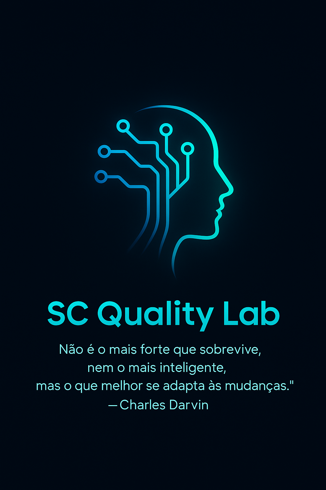

<a id="readme-top"></a>
<br />

<div align="center">
  <a href="https://github.com/sidjp/case-qa-senai-sc">
     
  </a>
  <h1>Case QA SENAI/SC</h1>
  <p>
    Autor: Sidney Chiyoshige  
    Processo Seletivo: 02521/2025 – Analista de Qualidade de Software Júnior (SENAI/SC – Soluções Digitais)
  </p>
  <p>
    Um projeto desenvolvido para o processo seletivo do SENAI/SC!  
    <br/>
    [Explore os Documentos »](https://github.com/sidjp/case-qa-senai-sc)  
    <br/><br/>
    [Solicitar Feature](https://github.com/sidjp/case-qa-senai-sc/issues/new?labels=enhancement)
  </p>
</div>

---

## 📑 Tabela de Conteúdos

1. [Sobre o Projeto](#-sobre-o-projeto)
   - [Tecnologias Utilizadas](#-tecnologias-utilizadas)
2. [Como Executar](#-como-executar)
   - [Pré-requisitos](#-pré-requisitos)
   - [Instalação](#️-instalação)
3. [Endpoints Principais](#-endpoints-principais)
4. [Testes Automatizados](#-testes-automatizados)
5. [CI/CD](#️-cicd)
6. [Plano de Testes](#-plano-de-testes)
7. [Decisões e Aprendizados](#-decisões-e-aprendizados)
8. [Possíveis Melhorias Futuras](#-possíveis-melhorias-futuras)
9. [Conclusão Pessoal](#-conclusão-pessoal)
10. [Contato](#-contato)

---

## 🧩 Sobre o Projeto


Este projeto foi desenvolvido como parte do estudo de caso técnico do processo seletivo do SENAI/SC.  
O objetivo foi criar uma aplicação simples, mas completa, para demonstrar habilidades práticas em QA, automação, versionamento e boas práticas de qualidade de software.

- **Stack escolhida:** JavaScript (Node.js + Express)
- **Foco:** Mostrar não apenas código funcional, mas também organização, clareza e entendimento de ponta a ponta do processo de qualidade — da análise à entrega testada.

<p align="right"><a href="#readme-top">🔝 Voltar ao topo</a></p>

---

### 🧰 Tecnologias Utilizadas

Esta seção lista as principais tecnologias usadas para construir o projeto.


<p align="right"><a href="#readme-top">🔝 Voltar ao topo</a></p>

---

## 🚀 Como Executar

Esta seção explica como configurar o projeto localmente.  
Siga os passos abaixo.

### 🧾 Pré-requisitos

### Certifique-se de ter as seguintes ferramentas instaladas:

- **npm**
  ```sh
  npm install npm@latest -g
- **Docker**
  ```sh
  docker --version

### ⚙️ Instalação

**1.  Clone o repositório:**

  ```sh
  git clone https://github.com/seu-username/case-qa-senai-sc.git
  ```
**2.  Instale as dependências:**

  ```sh
  cd case-qa-senai-sc
  npm install
  ```
**3.  Suba o banco de dados com Docker:**

  ```sh
  docker compose up -d
  ```
**4.  Inicialize o banco e insira dados iniciais:**

  ```sh
  npm run db:init
  npm run db:seed
  ```
**5.  Inicie o servidor:**

  ```sh
  npm run dev
  ```
**6.  Acesse a aplicação em:**

  👉 http://localhost:3000
<p align="right"><a href="#readme-top">🔝 Voltar ao topo</a></p>

---

## 🧭 Endpoints Principais

| Método | Rota             | Descrição                     |
|--------|------------------|-------------------------------|
| GET    | `/api/users`     | Lista todos os usuários       |
| POST   | `/api/users`     | Cadastra um novo usuário      |
| DELETE | `/api/users/:id` | Remove um usuário pelo ID     |
| GET    | `/health`        | Verifica se o servidor está ativo |

<p align="right"><a href="#readme-top">🔝 Voltar ao topo</a></p>

---
## 🧪 Testes Automatizados

A suíte de testes cobre:

- Validações de entrada  
- Cenários de sucesso e erro  
- Fluxos de criação, duplicidade e exclusão de usuários  

### Como Executar os Testes

- **Cypress (interativo):**
  ```sh
  npm run test:open

- **Cypress (headless, para CI):**
  ```sh
  npm run test:e2e
- **Testes unitários e de integração (Jest):**
  ```sh
  npm test
<p align="right"><a href="#readme-top">🔝 Voltar ao topo</a></p>

---

## ⚙️ CI/CD 

O projeto possui um pipeline no GitHub Actions, executado a cada push na branch principal:

**1.  Sobe um container PostgreSQL temporário**  
**2. Executa o lint (ESLint)**  
**3. Roda testes unitários e de integração (Jest)**  
**4. Sobe a API e executa testes E2E (Cypress headless)**  
**Isso garante validação automatizada completa para alterações no código.**
<p align="right"><a href="#readme-top">🔝 Voltar ao topo</a></p>

---

## 🧭 Plano de Testes

O plano completo está no diretório docs/ e inclui:
- **Escopo dos testes**
- **Casos de teste (CT-01 a CT-05)**
- **Critérios de aceitação**
- **Evidências de execução (capturas de tela do Cypress)**
<p align="right"><a href="#readme-top">🔝 Voltar ao topo</a></p>

---

## 💡 Decisões e Aprendizados

### Decisões Técnicas
- **Uso de Node.js puro (sem ORM) para maior clareza nas queries SQL**
- **Implementação de camadas explícitas para demonstrar entendimento de arquitetura**
- **Validação de entrada com Zod para prevenir erros comuns**
- **Desenvolvimento do zero com testes manuais em cada etapa**
### Maior Aprendizado
“Mesmo em um projeto simples, é possível aplicar princípios de qualidade, rastreabilidade e automação que fazem diferença em um ambiente real.”
<p align="right"><a href="#readme-top">🔝 Voltar ao topo</a></p>

---

## 🔮 Possíveis Melhorias Futuras

- **Adicionar endpoint para edição de usuário (PUT /api/users/:id)**
- **Implementar testes de API com Supertest**
- **Gerar relatórios HTML de testes Cypress (Mochawesome)**
- **Configurar pipeline de deploy automatizado**
<p align="right"><a href="#readme-top">🔝 Voltar ao topo</a></p>

---

## 🧠 Conclusão Pessoal

**Este projeto foi uma oportunidade de revisar fundamentos, aplicar boas práticas e consolidar minha paixão por garantir a qualidade de software.
Mais do que um teste, encarei como um desafio real de aprendizado e evolução profissional.
Acredito que essa postura agrega valor a qualquer equipe — especialmente em uma instituição como o SENAI/SC, que valoriza excelência e inovação.**
<p align="right"><a href="#readme-top">🔝 Voltar ao topo</a></p>

---

## 📬 Contato

Email: sidjp05@gmail.com

GitHub: https://github.com/sidjp

**Desenvolvido com foco em qualidade, automação e aprendizado contínuo.**


